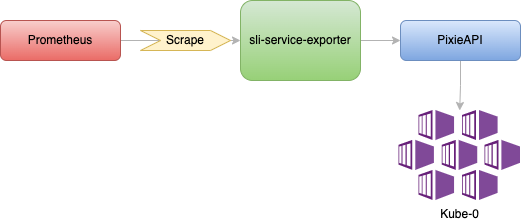

# Welcome to SLI Exporter!

This exporter was created to collect data from Pixie and expose this to Prometheus. This way We can be monitoring proactively our services and then creates alarms to identify problems.


# Architechture

This script has a python application to export golden signal metrics retrieved from Pixie API using a PXL script.
These metrics are exposed to Prometheus.





### Run locally
To run script:
```bash
# Set env vars
export PIXIE_API_KEY=[token_from_pixie]
export PIXIE_CLUSTER_ID=[id_from_observed_cluster]

# Run docker compose
$ make run
```

### Deploy
To deploy the exporter you can run the following command
```bash
$ make deploy
```

### Changes
To make changes in source code you will need to define a new tag editing Makefile.
```bash
$ sed -i -e 's/TAG:=1.0.4/TAG:=1.0.5/g'  Makefile
```

#### Setting environment variable

#### Build image
To build an image you will need to do login into docker registry:
```bash
$ docker login
```
And then:
```bash
# Build image
$ make docker build
# Push image to gcr
$ make docker push
```
And finally to deploy:
```bash
$ make deploy
```
